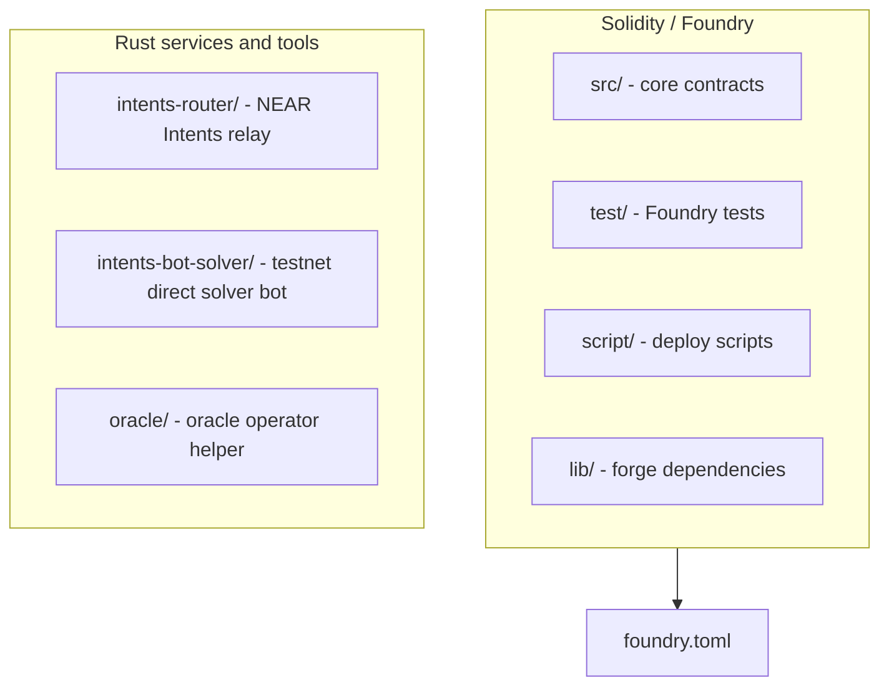
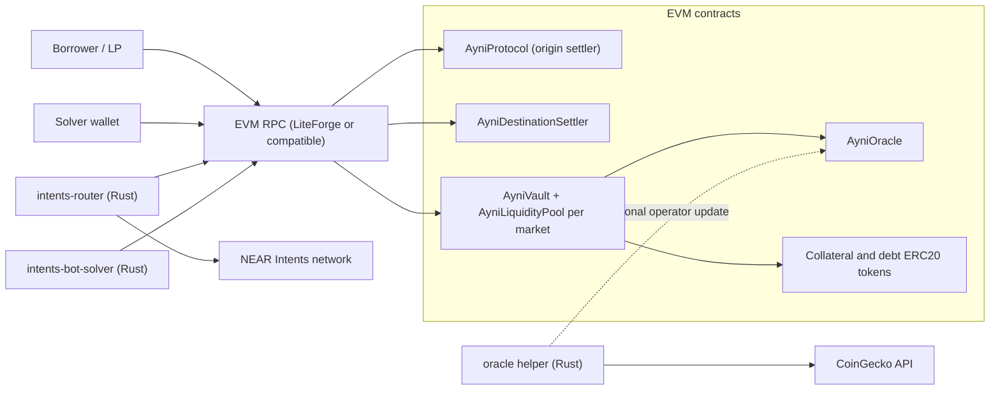
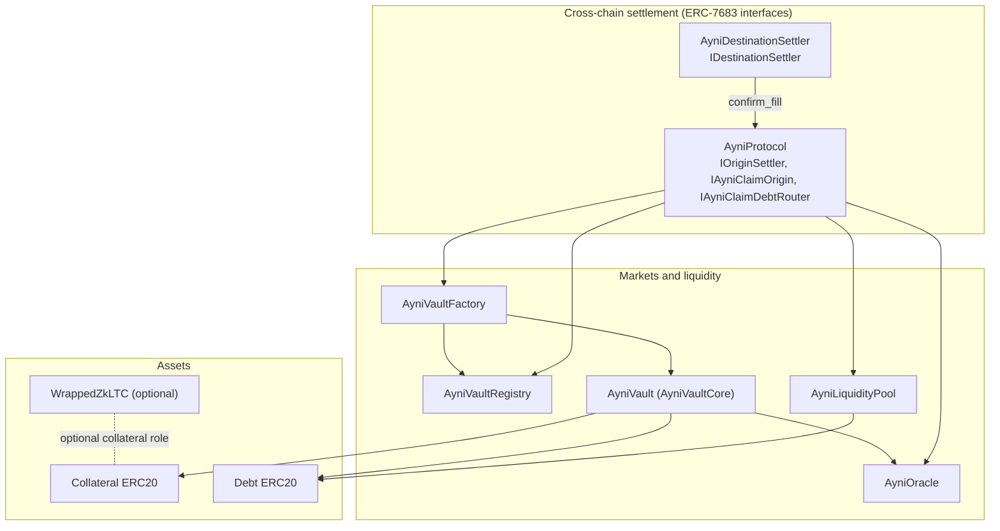
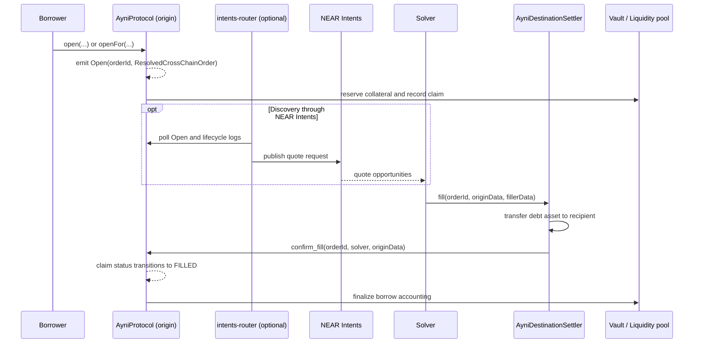
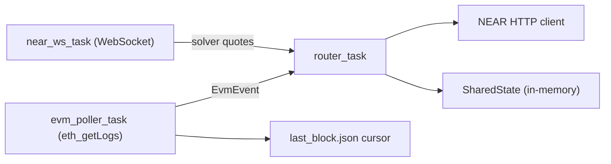
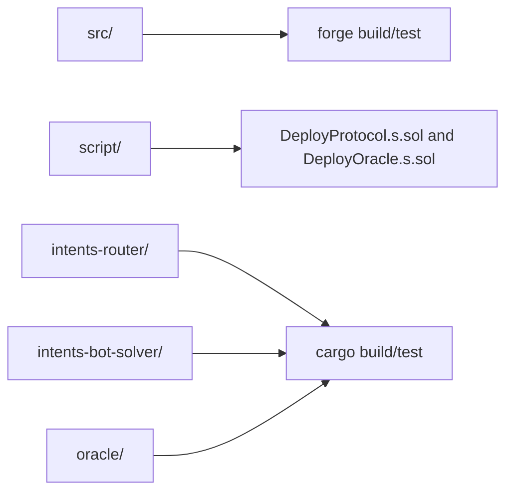

# AyniProtocol Architecture

This document describes the architecture of the current repository, including the on-chain protocol, off-chain services, and cross-chain borrow intent flow.

## Table of Contents

- [Repository layout](#repository-layout)
- [System context](#system-context)
- [On-chain architecture](#on-chain-architecture)
- [Cross-chain borrow flow](#cross-chain-borrow-flow)
- [Intents router runtime model](#intents-router-runtime-model)
- [Build and deployment touchpoints](#build-and-deployment-touchpoints)
- [Design boundaries](#design-boundaries)

## Repository layout

## System context

## On-chain architecture

## Cross-chain borrow flow

## Intents router runtime model

## Build and deployment touchpoints

## Design boundaries

- On-chain contracts enforce custody and economic invariants.
- Rust services are operational helpers (relay, bot, operator tooling), not protocol trust anchors.
- Cross-chain intent primitives follow `src/intents/ERC7683.sol`.
- For exact business rules and edge-case behavior, treat `src/` and `test/` as the source of truth.
